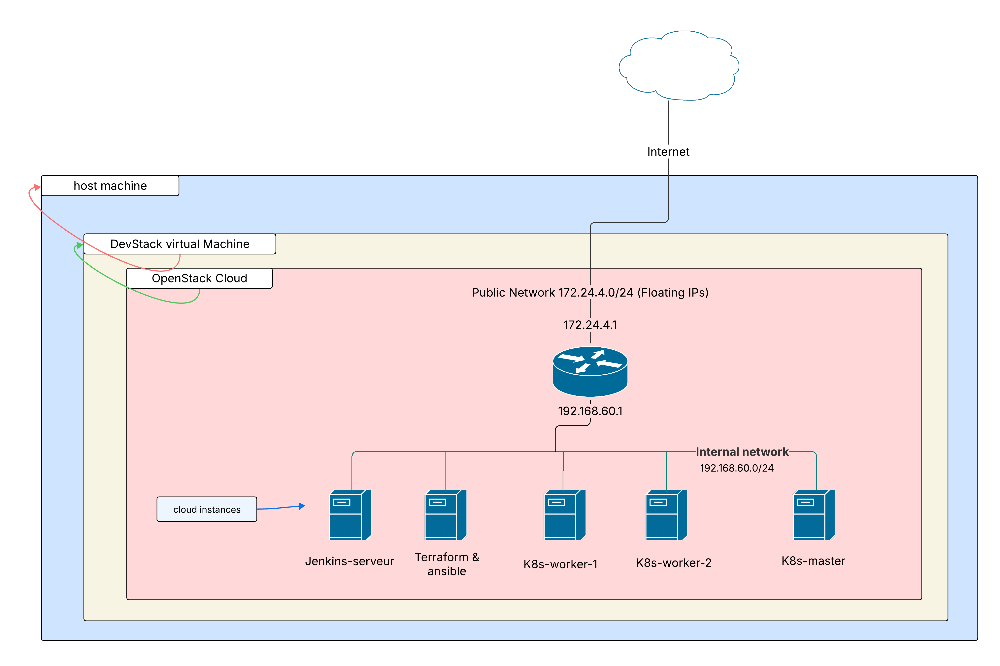

# 🚀 Déploiement Automatisé et CI/CD Sécurisé pour une Application en Microservices  
## ☁️ Déploiement sur Cloud Privé OpenStack (DevStack)

## 📌 Contexte du projet

Ce projet est réalisé dans le cadre du **mémoire de Master Professionnel en Sécurité des Systèmes Informatiques**.  
Il consiste à concevoir et mettre en œuvre une **plateforme DevSecOps complète** pour le **déploiement automatisé et sécurisé d’une application en microservices**, hébergée sur un **cloud privé OpenStack déployé via DevStack**.

L’infrastructure cloud sert de **socle IaaS**, sur lequel sont déployés les composants **Kubernetes, CI/CD, sécurité et monitoring**.

---

## 🎯 Objectifs du projet

- Déployer un **cloud privé OpenStack** avec DevStack
- Exploiter OpenStack comme **infrastructure IaaS sécurisée**
- Automatiser le provisioning des ressources cloud
- Mettre en place un **pipeline CI/CD sécurisé (DevSecOps)**
- Déployer une application **microservices conteneurisée**
- Garantir la **haute disponibilité, la sécurité et l’observabilité**

---

## ☁️ Infrastructure Cloud Privée (OpenStack)

### 🔹 Plateforme Cloud
- **OpenStack** (déployé via **DevStack**)
- Services OpenStack utilisés :
  - **Nova** : gestion des machines virtuelles
  - **Neutron** : réseau virtuel et sécurité
  - **Cinder** : stockage bloc
  - **Glance** : gestion des images
  - **Keystone** : authentification et gestion des identités

### 🔹 Sécurité Cloud
- Isolation réseau via Neutron
- Security Groups (pare-feu)
- Gestion des identités (Keystone)
- Accès SSH sécurisé
- Segmentation réseau (front / back / management)

---

## 🧩 Architecture Globale

### 🌐 Schéma Réseau de l’Infrastructure OpenStack


---

## 🛠️ Technologies & Outils

### ☁️ Cloud & Infrastructure
- OpenStack (DevStack)
- Terraform (provisionnement IaaS)
- Ansible (configuration)

### 🐳 Conteneurisation & Orchestration
- Docker
- Kubernetes
- Helm
- NGINX Ingress Controller

### 🔁 CI/CD
- Jenkins ou GitLab CI/CD
- Docker Registry privé

### 🔐 Sécurité (DevSecOps)
- Trivy (scan images Docker)
- SonarQube (SAST)
- OWASP ZAP (DAST)
- HashiCorp Vault (secrets)
- RBAC Kubernetes
- TLS / HTTPS

### 📊 Observabilité
- Prometheus
- Grafana
- ELK Stack

---

## 🔄 Pipeline CI/CD Sécurisé

1. **Commit du code**
2. **Analyse SAST (SonarQube)**
3. **Build des images Docker**
4. **Scan des vulnérabilités (Trivy)**
5. **Tests automatisés**
6. **Déploiement Kubernetes via Helm**
7. **Tests DAST (OWASP ZAP)**
8. **Monitoring & Alerting**

### 🔄 Schéma du Pipeline CI/CD Sécurisé


🔐 Toute vulnérabilité critique bloque automatiquement le pipeline.

---

## 📂 Structure du projet

```bash
devops-project/
│
├── openstack/
│   ├── devstack/
│   ├── terraform/
│   └── ansible/
│
├── app/
│   ├── frontend/
│   ├── auth-service/
│   ├── product-service/
│   └── dashboard-service/
│
├── ci-cd/
│   ├── Jenkinsfile
│   └── gitlab-ci.yml
│
├── k8s/
│   ├── manifests/
│   └── helm-charts/
│
├── security/
├── monitoring/
└── README.md
